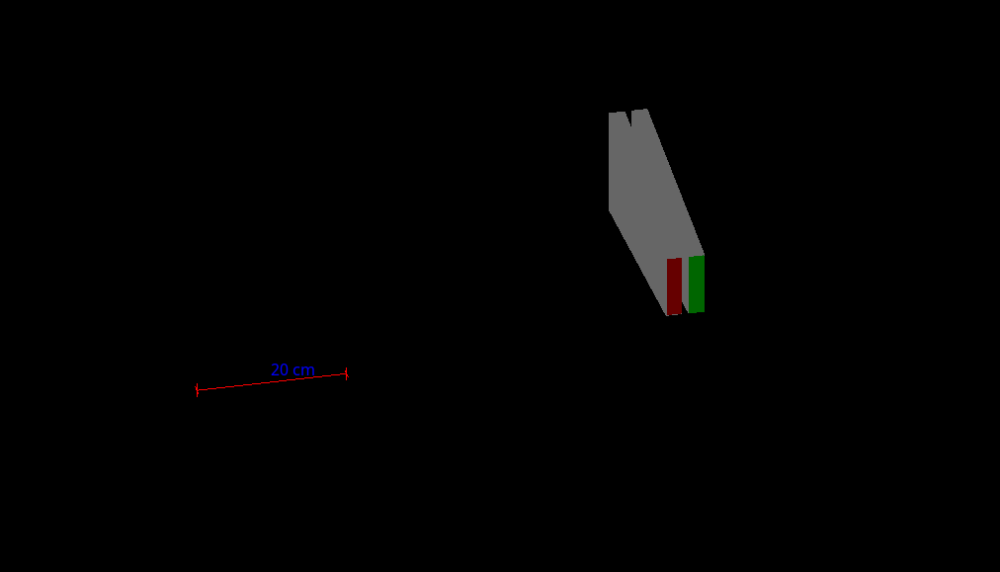
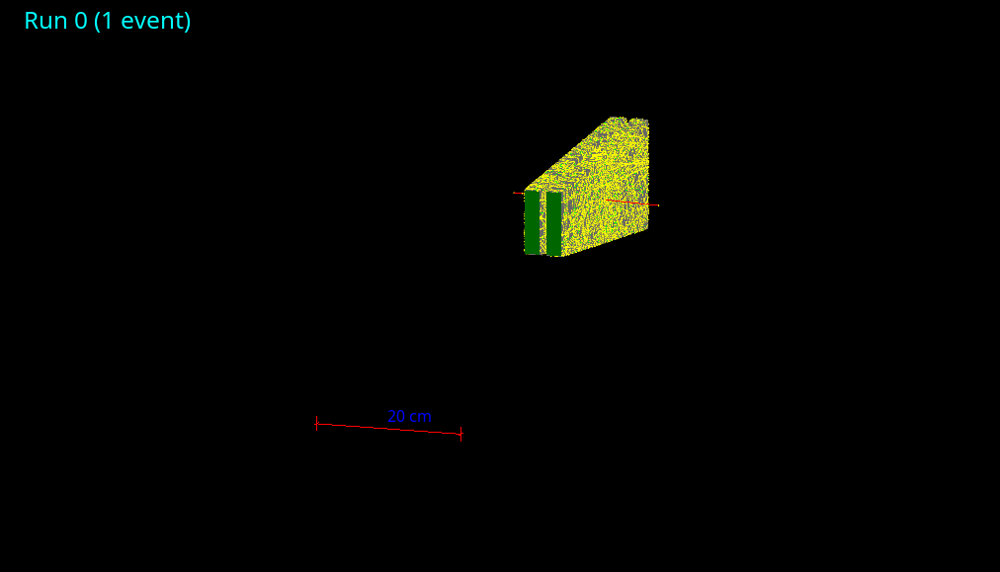
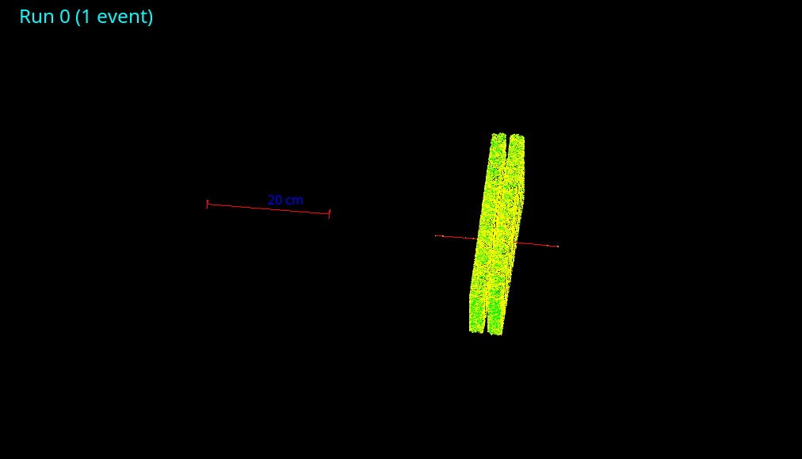

# 本科生科研粒子探测器模拟
本人于 2016 年参加唐健老师的本科生科研项目，期间得到唐老师的悉心指导，在此非常感谢唐老师，回首过往，感慨万千，亦师亦友，收获颇多，去年今时，盛情邀请，欣然许之，一年过去，也从小白变成了大白了。

本项目由国家基础科学人才培养基金资助
## geant4
Geant４是由欧洲核子中心(CERN)和日本高能物理中心(KEK)主导开发的蒙特卡罗辐射输运计算通用程序包,主要应用在高能物理领域,可方便模拟强相互作用、弱相互作用等高能、超高能物理过程。

本程序还利用了[gear](https://github.com/jintonic/gears/)的相关代码，实现探测器的几何构建


[geant4安装与编写要点](doc/geant4.md) 
## 缪子
缪子是一种与电子相似的基本粒子，符号 , 它带有 1 单位负电荷，自旋为 1/2，质量为 105 . 缪子的反粒子是 ,拥有 1 单位正电荷．地球上绝大部分自然生成的缪子都由宇宙
线中的介子产生( ).大多数缪子在海平面以上  15km  处产生．因为不参与强相互作用，缪子的穿透能力很强．与绝大部分高能碰撞产生的粒子一样，缪子也是不稳定的．缪子的平均寿命约为2.2us, 准确值为 2.1969811(22)×10−6 s，缪子的衰变方式:


## 实验装置
探测器的核心是两个高 338.5 mm，下底面长143.5 mm ， 上底面长 84 mm，厚 2 cm 的梯形形 塑 料 闪 烁 体，材 料 为 ，其密 度为 1.25*g/cm3，它们间隔为 10 mm，当一个高能缪子或电子穿越探测器时，其轨迹上会产生微弱的荧光．这些荧光会被光电倍增管接收并放大为电信号．为了增加光的收集率，探测器被一层氧化铝反射层包裹

如图所示:


**其中红色为探测器，白色为氧化铝反射层，绿色为光电倍增管的光窗**


<video id="video" controls=""  >
      <source id="mpeg" src="http://ow3kig4i4.bkt.clouddn.com/GMovie.mpeg" type="video/mpeg">
</video>
    
## 运行结果
在探测器板上方 75 mm 的高度发射，能量为 150 MeV， 方向为 z 轴负方向。
如图所示:


**其中红色径迹代表为带负电的缪子，绿色径迹代表是不带电的光子，缪子打在塑闪板上发出光子，光子在里面发射，直到打在光电倍增管上，被吸收**

## 文件介绍
├── blank 存放一个空白的 geant4 代码，可以基于这个搭建自己的 geant4 程序

├── CMakeLists.txt cmake 文件

├── doc 注释生成文件 可以运行里面的 html 文件夹下的 index.html 文件查看文档，也可以打开 latex 文件夹下的 refman.pdf 

├── pic 存放图片

├── macro 存放宏文件

│   ├── vis.mac 可视化图形界面的设定

│   ├── init_vis.mac 初始化图形界面的宏文件，调用 vis.mac文件

│   ├── otherdrive.mac 调用不同图形界面引擎

│   ├── run.mac

├── shell_py 存放shell 脚本和python数据处理文件

│   ├── detector

│   │   ├── cal_aver_var.py 读取 detect_result .csv , 计算平均值和方差

│   │   ├── detect_one_csv.py 读取一个 $\mu$ 的能量产生的数据，平均值和方差

│   │   ├── detect_one_csv.sh 通过运行 detect_one_csv.py，读取各个$\mu$ 能量的数据合成一个 csv 文件

│   │   ├── detect.py 读取 muon_nt_detect.csv 文件，生成 detect_result .csv  一个$mu$ 能量的1000事例的能量信息，位置信息

│   │   └── detect.sh 通过运行 detect.py，读取各个$\mu$ 能量的数据，生成 detect_result .csv

│   ├── pmt

│   │   ├── pmt_cal.py   读取 pmt_result.csv，统计衰变时间

│   │   ├── pmt_cal.sh  通过运行 pmt_cal.py， 统计各个$\mu$ 能量衰变时间

│   │   ├── pmt.py 读取 muon_nt_pmt.csv 文件，生成 pmt_result .csv  一个$mu$ 能量的1000事例的进入 pmt 的衰变光子能量平均值和方差以及光子个数，进入时间的平均值和方差，以及$\mu$产生光子能量平均值和方差以及光子个数，进入时间的平均值和方差

│   │   └── pmt.sh 通过运行 pmt.py，读取各个$\mu$ 能量的数据

│   └── run

│       ├── muon.sh 读取 run.mac 生成一个新的$\mu$ 能量的宏文件 new.mac 

│       └── test.sh 运行程序以及宏文件 new.mac， 并将生成的 muon_nt_detect.csv 和 muon_nt_pmt.csv 放在 data 文件夹下

├── result 存放运行结果

├── include 库文件的存放文件夹

├── src 源文件夹

├── main.cc 程序主文件

├── Doxyfile doxygen 文件


## 运行和结果
先编译程序

```
mkdir build
cd build
cmake the_path_to_the_project/
make -j4
```

拷贝运行脚本和画图脚本

```
cd build
cp the_path_to_the_project/result/shell_py ./
mv the_path_to_the_project/result/shell_py/run/*.sh ./
```

打开`macro/run.mac`，设置相应的参数，记录两个探测器的厚度和距离，再运行

```
./run.sh
./cal.sh theThicknessNumberofFirstDetector theThicknessNumberofSecondDetector theDistance 
```

画图
```
cp the_path_to_the_project/result/shell_py/pmt/pmt_plot.py ./data/GeV
cp the_path_to_the_project/result/shell_py/detector/detector_plot.py ./data/GeV
cd ./data/GeV
python detector_plot.py
python pmt_plot.py
```
Monday, 04. September 2017 09:53AM 
