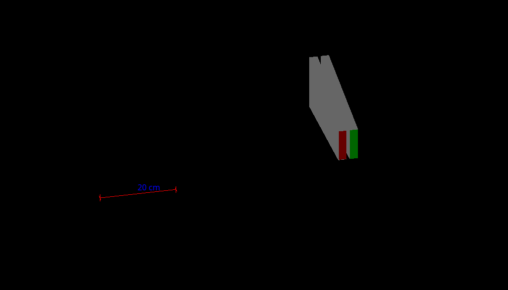

# 本科生科研粒子探测器模拟
本人于 2016 年参加唐健老师的本科生科研项目，期间得到唐老师的悉心指导，在此非常感谢唐老师，回首过往，感慨万千，亦师亦友，收获颇多，去年今时，盛情邀请，欣然许之，一年过去，也从小白变成了大白了。

本项目由国家基础科学人才培养基金资助
## geant4
Geant４是由欧洲核子中心(CERN)和日本高能物理中心(KEK)主导开发的蒙特卡罗辐射输运计算通用程序包,主要应用在高能物理领域,可方便模拟强相互作用、弱相互作用等高能、超高能物理过程。
## 缪子
缪子是一种与电子相似的基本粒子，符号 $\mu^-$, 它带有 1 单位负电荷，自旋为 1/2，质量为 105 $MeV/c^2$. 缪子的反粒子是 $\mu^+$,拥有 1 单位正电荷．地球上绝大部分自然生成的缪子都由宇宙
线中的 $\pi$ 介子产生($\pi^- \rightarrow \mu^- + \bar{\nu_u} \ \pi^+\rightarrow \mu^+ + \nu_\mu$ ).大多数缪子在海平面以上  15km  处产生．因为不参与强相互作用，缪子的穿透能力很强．与绝大部分高能碰撞产生的粒子一样，缪子也是不稳定的．缪子的平均寿命约为$2.2\mu s$, 准确值为 2.1969811(22)×10−6 s，缪子的衰变方式:
$$
\mu^- \rightarrow e^- + \nu_\mu + \bar\nu_\mu\\
\mu^+ \rightarrow e^+ + \bar\nu_\mu + \nu_\mu
$$
## 实验装置
探测器的核心是一个高 338.5 mm，下底面长143.5 mm ， 上底面长 84 mm，厚 2 cm 的梯形形 塑 料 闪 烁 体，材 料 为 $ C_1{0H}_{14} $，其密 度为 1.25*g/cm3，当一个高能缪子或电子穿越探测器时，其轨迹上会产生微弱的荧光．这些荧光会被光电倍增管接收并放大为电信号．为了增加光的收集率，探测器被一层氧化铝反射层包裹

如图所示:

**其中红色为探测器，白色为氧化铝反射层，绿色为光电倍增管的光窗**

<video id="video" controls=""  >
      <source id="mpeg" src="./pic/GMovie.mpeg" type="video/mpeg">
</video>
    
## 运行结果

Monday, 04. September 2017 09:53AM 