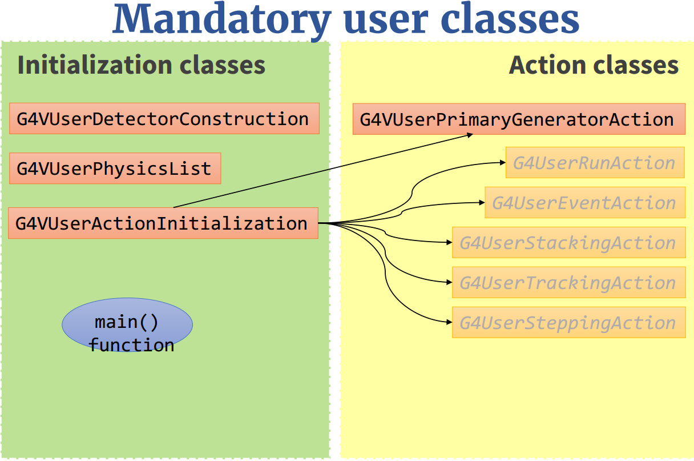

#geant4 总结

[TOC]

## gean4 安装
### 下载源文件
网站为：[geant4下载](http://geant4.web.cern.ch/geant4/support/download.shtml)]

linux：source files 一栏有一个 gU or linux tar format, 下载这个
记得下载所有的 data files
这些数据文件包括：
- G4ABLA.3.0.tar.gz
- G4NEUTRONXS.1.4.tar.gz
- G4SAIDDATA.1.1.tar.gz
- G4EMLOW.6.35.tar.gz
- G4PhotonEvaporation.3.0.tar.gz
- RealSurface.1.0.tar.gz
- G4ENSDFSTATE.1.0.tar.gz
- G4PII.1.3.tar.gz
- G4NDL.4.4.tar.gz
- G4RadioactiveDecay.4.0.tar.gz

版本名可能会发生改变,解压缩这些文件
```shell
for i in `ls *.gz'
do 
	tar -zxvf $i
done
```
### 编译安装
```shell
cd the path to source
mkdir build(the name you want)
cd build
cmake [options] ./the path to source
make -j4
make install
```
options 有一个安装路径要说明的 `DCMAKE_INSTALL_PREFIX=/projects/soft/ext/geant4.10.00.p02-install` 这样就会安装到`/projects/soft/ext`下新建一个`geant4.10.00.p02-install`文件夹

其他的`options` 查看 [geant4安装说明](http://geant4.web.cern.ch/geant4/support/userdocuments.shtml)

这里提供一个安装命令供参考
```
cmake -DCMAKE_INSTALL_PREFIX=~/program/geant4/install -DGEANT4_USE_GDML=ON  DGEANT4_USE_QT=ON -DGEANT4_USE_OPENGL_X11=ON -DGEANT4_USE_RAYTRACER_X11=ON  -DGEANT4_BUILD_MULTITHREADED=ON -DGEANT4_USE_XM=ON -DGEANT4_USE_X11=ON -DGEANT4_USE_SYSTEM_ZLIB=ON  ../geant4-10.3.1/
```
这里，我们通过**cmake**指定
- Geant4安装目录为**~/program/geant4/install**
- 启用了** GDML QT  XM OPENGL_X11 RAYTRACER_X11 X11 ZLIB**
- 启用**多线程模式**

### 环境设置和 data 目录
```
source the path to install/share/Geant4.10.3/geant4make/geant4make.sh
```
说明一下**geant4.10.3**会随着版本号改变

data 的目录`the path to  install/share/Geant4.10.3/`

# geant4 代码编写入门
先大概介绍各个文件的作用，理解每个文件应该做什么，理解到 geant4 的框架是什么样后，就明白接下来就是参考资料，写代码了

每个文件基本要写库文件(.hh)和源文件(.cc)，分别放在**include**和**src**文件夹

geant4 要告诉探测器的结构和设计的物理过程是怎么样的，有了这些就可以运行了，但是geant4的数据是保存在内存里面的，所以要通过 action 类把这些信息重新获取出来

先介绍主文件
## main.cc
必须新建三个强制类
- DetectorConstruction
- PhylicsList
- ActionInitialization

交给`runManager`管理，main 函数也可以新建宏文件调用的对象 batch mode ，和`terminal`控制的对象 可视化界面和 Interactive mode

```cpp
// 宏文件调用
G4UImanager* UImanager = G4UImanager::GetUIpointer();
G4String command = "/control/execute ";
G4String fileName = argv[1];
UImanager->ApplyCommand(command + fileName);

// G4UIExecutive 类似 G4UIsession Interactive mode 可视化界面
//ifdef G4VIS_USE
  G4VisManager* visManager = new G4VisExecutive("quiet");
  visManager->Initialize();
//endif  
G4UIExecutive* ui = new G4UIExecutive(argc, argv);
ui->SessionStart();

delete visManager;
delete ui;
```

1. Detector construction
- Define the geometry of your model (Construct()函数)
 * All materials
 * All volumes & placements
- (Optionally) add fields (ConstructSDandField()函数)
- (Optionally) define volumes for read-out (sensitive detectors)(ConstructSDandField()函数)

```cpp
class G4VUserDetectorConstruction
{
public:
G4VUserDetectorConstruction();
virtual ~G4VUserDetectorConstruction();
public:
virtual G4VPhysicalVolume* Construct() = 0;
virtual void ConstructSDandField();

}
```

2. Physics list

- Define all necessary particles (ConstructParticle() 函数)
- Define all necessary processes and assign them to proper particles (ConstructProcess() 函数)
- Define particles production threshold (in terms of range) (SetCuts()函数)


```cpp
class G4VUserPhysicsList
{
public:
G4VUserPhysicsList();
virtual ~G4VUserPhysicsList();
public:
virtual void ConstructParticle() = 0;
virtual void ConstructProcess() = 0;
virtual void SetCuts();
// ...
}
```

3. Primary generator action

所有的 action 类都应该在 ActionInitialization 类初始化

- Define the source of simulated particles
-  kinematic properties
-  additional information

位置信息必须放在 GeneratePrimaries(G4Event* ) 函数中

```cpp
class G4VUserPrimaryGeneratorAction
{
public:
G4VUserPrimaryGeneratorAction();
virtual ~G4VUserPrimaryGeneratorAction();
public:
virtual void GeneratePrimaries(G4Event* anEvent) = 0;
// ...
}
```

## DetectorConstruction.cc

- Method Construct()
 - Define materials
 - Define solids and volumes of the geometry
 - Build the tree hierarchy of volumes
 - Define visualization attributes
 - Return the world physical volume!
- Method ConstructSDAndField()
 - Assign magnetic field to volumes / regions
 - Define sensitive detectors and assing them to volumes

### 材料的定义

```cpp
// use nist
G4NistManager* manager = G4NistManager::Instance();
G4Material* H2O = manager->FindOrBuildMaterial("G4_WATER");

// user define
a = 14.01*g/mole;
G4Element* elN = new G4Element(name="Nitrogen",symbol="N", z= 7., a);
a = 16.00*g/mole;
G4Element* elO = new G4Element(name="Oxygen",symbol="O", z= 8., a);
density = 1.290*mg/cm3;
G4Material* Air = new G4Material(name="Air", density, ncomponents=2);
Air->AddElement(elN, 70.0*perCent);
Air->AddElement(elO, 30.0*perCent);
```
### Geometry


构建过程为，构建 Solid->logicalVolume->PVPlacement, 可以查找相应的 api

### EM Fields
#### 均匀场

```cpp
// 某个 Volume
G4ThreeVector field(0,1.*tesla,0);
4UniformMagField* magField = new G4UniformMagField(field);
G4FieldManager* fieldMgr =
G4TransportationManager::GetTransportationManager()
->GetFieldManager();
fieldMgr->SetDetectorField(magField);
fieldMgr->CreateChordFinder(magField);

// 全部区域加场
G4GlobalMagFieldMessenger* fMagFieldMessenger =
new G4GlobalMagFieldMessenger(field)
```

#### 非均匀场
创建一个继承 `G4MagneticField`新的类来实现$\vec{B}=f(\vec{x},t)$
```cpp
// MyField 继承 G4MagneticField 新的类
MyField* myField = new MyField();
G4FieldManager* fieldMgr =
G4TransportationManager::GetTransportationManager()
->GetFieldManager();
fieldMgr->SetDetectorField(myField);
fieldMgr->CreateChordFinder(myField);
```

也可以在 `logicalVolume` 下用相应的方法设置场

```cpp
MyField* myField = new MyField();
G4FieldManager* localFieldMgr =
new G4FieldManager(myField);
G4bool allLocal = true;
logicVolWithField//you volume
->SetFieldManager(localFieldMgr, allLocal);
```

敏感探测器在保存数据章节介绍

## Generation of a primary event

- Method GeneratePrimaries()
 - Randomize particle-by-particle value, if required
 - Set these values to the primary generator
 - Invoke GeneratePrimaryVertex() method of primary generator
 `particleGun->GeneratePrimaryVertex(event)` 必须要写

- Constructor
 - Instantiate primary generator
 - (Optional, but advisable): set the default values for energy and Particle Definition 

## Physics list

- Method ConstructParticle() 构建粒子
- Method ConstructProcess() 构建过程
- Method SetCuts() 设置阈值

### 构建粒子
两种方式

```cpp
// first
G4Electron::ElectronDefinition();
G4Proton::ProtonDefinition();
G4Neutron::NeutronDefinition();
G4Gamma::GammaDefinition();

// second
G4BaryonConstructor bConstructor;
bConstructor.ConstructParticle();
```
### 构建过程
1. For each particle, get its process manager

```cpp
G4ProcessManager *elManager = G4Electron::ElectronDefinition()->GetProcessManager();
```

2. Construct all processes and register them

```cpp
elManager->AddProcess(new G4eMultipleScattering, -1, 1, 1);
elManager->AddProcess(new G4eIonisation, -1, 2, 2);
elManager->AddProcess(new G4eBremsstrahlung, -1, -1, 3);
elManager->AddDiscreteProcess(new G4StepLimiter)
```

## 数据保存
新介绍各个 action 类可以做什么
### action 类
#### runAction
G4UserRunAction
- void BeginOfRunAction(const G4Run*)
- void EndOfRunAction(const G4Run*)
- G4Run* GenerateRun()
Uses:
- Book/output histograms and other analysis tools
- Custom G4Run with additional information
- Define parameters

#### EverntAction
G4UserEventAction
- void BeginOfEventAction(const G4Event*)
- void EndOfEventAction(const G4Event*)

Uses:
- Hit collection and event analysis
- Event selection
- Logging (e.g. output event number)

#### StackingAction
G4UserStackingAction
- G4ClassificationOfNewTrack ClassifyNewTrack(const G4Track*)
- void NewStage()
- void PrepareNewEvent()

Uses:
- Pre-selection of tracks (~manual cuts)
- Optimization of the order of track execution

#### TrackingAction
G4UserTrackingAction
- void PreUserTrackingAction(const G4Track*)
- void PostUserTrackingAction(const G4Track*)

Uses:
- Track pre-selection
- Store trajectories

#### SteppingAction
G4UserSteppingAction
- void UserSteppingAction(const G4Step*)

Uses:
-  Get information about particles
-  Kill tracks under specific circumstances

### Accumulable 保存数据
介绍：通过各个 action 将数据保存到 accumulable 变量中
1. Declare (instance) variables (of RunAction文件中)

```cpp
G4Accumulable<G4int> fNElectrons;
G4Accumulable<G4double> fAverageElectronEnergy;
```

2. Register to accumulable manager (in RunAction constructor)

```cpp
G4AccumulableManager* accManager = G4AccumulableManager::Instance();
accManager->RegisterAccumulable(fNElectrons);
accManager->RegisterAccumulable(fAverageElectronEnergy);
```

3. Reset to zero values (in RunAction::BeginOfRunAction)

```cpp
G4AccumulableManager* accManager = G4AccumulableManager::Instance();
accManager->Reset();
```

4. Update during run (e.g. in Stacking action)

```cpp
fNElectrons += 1; // Normal arithmetics
```

5. Merge after run (in RunAction::EndOfRunAction)

```cpp
G4AccumulableManager* accManager = G4AccumulableManager::Instance();
accManager->Merge();
```

6. Report after run (in RunAction::EndOfRunAction)

```cpp
G4AccumulableManager* accManager = G4AccumulableManager::Instance();
if (IsMaster())
{
if (fNElectrons.GetValue())
{
G4cout << " * Produced " << fNElectrons.GetValue();
G4cout << " secondary electrons/event. Average energy: ";
G4cout << fAverageElectronEnergy.GetValue() / keV / fNElectrons.GetValue();
G4cout << " keV" << G4endl;
}
else
G4cout << " * No secondary electrons produced" << G4endl;
}
```

### 数据输出到外部文件

1. 打开文件和设置文件参数 histograms & Ntuples

```cpp
// histograms
void MyRunAction::BeginOfRunAction(const G4Run* run)
{
// Get analysis manager
G4AnalysisManager* man = G4AnalysisManager::Instance();
man->SetVerboseLevel(1);
man->SetFirstHistoId(1); // 文件开始的 id 为 1 
// Creating histograms
man->CreateH1("h", "Title", 100, 0., 800*MeV);// id =1
man->CreateH1("hh", "Title", 100, 0., 10*MeV);// id =2
// Open an output file
man->OpenFile("myoutput");
}

// Ntuples
void MyRunAction::BeginOfRunAction(const G4Run* run)
{
// Get analysis manager
G4AnalysisManager* man = G4AnalysisManager::Instance();
man-> SetFirstNtupleId(1); // 文件开始的 id 为 1 
// Creating ntuples
man->CreateNtuple("name", "Title"); // id =1
man->CreateNtupleDColumn("Eabs");
man->CreateNtupleDColumn("Egap");
man->FinishNtuple();
man->CreateNtuple("name2","title2"); // id =2
man->CreateNtupleIColumn("ID");
man->FinishNtuple();
}
```

2. 写入数据

```cpp
void MyEventAction::EndOfEventAction(const G4Run* aRun)
{
auto man = G4AnalysisManager::Instance();
man->FillH1(1, fEnergyAbs); // 填写第一个
man->FillH1(2, fEnergyGap); // 填写第二个
}
MyRunAction::~MyRunAction()
{
auto man = G4AnalysisManager::Instance();
man->Write();
}
int main()
{
...
auto man = G4AnalysisManager::Instance();
man->CloseFile();
}

// Ntuples
void MyEventAction::EndOfEventAction(const G4Run* aRun)
{
G4AnalysisManager* man = G4AnalysisManager::Instance();
man->FillNtupleDColumn(1, 0, fEnergyAbs);// id = 1 columns 0,1
man->FillNtupleDColumn(1, 1, fEnergyGap);
man->AddNtupleRow(1);
man->FillNtupleIColumn(2, 0, fID);;// id = 1 columns 0
man->AddNtupleRow(2);
}
MyRunAction::~MyRunAction()
{
auto man = G4AnalysisManager::Instance();
man->Write();
}
int main()
{
...
auto man = G4AnalysisManager::Instance();
man->CloseFile();
}

```
```

## 敏感探测器

### 注册敏感探测器

在 ConstructSDandField() 函数写
```cpp
G4VSensitiveDetector* mySensitive= new MySensitiveDetector(SDname="/MyDetector"); // 可以是自己定义的敏感探测器也可以是系统自带的多功能探测器
G4SDManager* sdMan =G4SDManager::GetSDMpointer();
sdMan->AddNewDetector(mySensitive);// Register tothe SD manager
SetSensitiveDetector("the name of your logical volume",mySensitive);// assign to logicalvolume
```
也可以用想要变成敏感探测器的 logicalVolume 下注册
```cpp
logicalVolume->SetSensitiveDetector(mySensitive);
```

### 调用系统自带多功能探测器

By using this approach, no need to implement sensitive detector and hit classes!

for example
```cpp
G4MultiFunctionalDetector* myScorer = new G4MultiFunctionalDetector(“myCellScorer”);//起名字，实例化多功能探测器

myCellLog->SetSensitiveDetector(myScorer);//attach to volume

G4VPrimitiveScorer* totalSurfFlux = new G4PSFlatSurfaceFlux(“TotalSurfFlux”);// 实例化一个功能
myScorer->RegisterPrimitive(totalSurfFlux);//注册功能
```

retrieve information

写在 EventAction 的 endofevent
1. 得到敏感探测器的 id，获取信息

```cpp
G4int collID = G4SDManager::GetSDMpointer()->GetCollectionID("myCellScorer/TotalSurfFlux");Get ID for the collection (given  the name)
```
2. 得到所有hit collection 的所有数据

```cpp
G4HCofThisEvent* HCE = event->GetHCofThisEvent(); //Get all HC available in this event
G4THitsMap<G4double>* evtMap = static_cast<G4THitsMap<G4double>*> (HCE->GetHC(collID));// Get the HC with the given ID (need a cast)
```

3. 读出 hit collection 的数据

```cpp
for (auto pair : *(evtMap->GetMap())) {
	G4double flux = *(pair.second);
	G4int copyNumber = *(pair.first);
	}
```

### 定义自己的敏感探测器

|Concrete class | Base class
-------|-----------|---------
Sensitive Detector | MySensitiveDetector| G4VSensitiveDetector 
Hit | myHit|G4VHit

`hits collection` 的指针为 `G4THitsCollection<MyHit*>`

#### G4VHit
Two virtual methods
- Draw()
- Print()

A “Hit” is like a “container”, a empty box which will store the information retrieved step by step.

The Hit concrete class (derived by G4VHit) must be written by the user: the user must decide *which variables* and/or information the hit should store and when store them

```cpp
class MyHit: public G4VHit{
public:
	MyHit();
	virtual ~MyHit();
	//决定获取沉积能量的信息
	inline void SetEnergyDeposit(G4double energy){energyDeposit = energy;}
	inline G4double GetEnergyDeposit(){return energyDeposit;}
	
private:
	G4double energyDeposit;
}
```

Hits objects can be filled with information in the ProcessHits() method of the SD concrete user class

#### SD
G4VSensitiveDetector
- Initialize()
- ProcessHits() pure virtual method
 - invoked for each step if step starts in logical volume having the SD attached
- EndOfEvent()

```cpp
class MySensitiveDetector : public G4VSensitiveDetector
{
public:
    MySensitiveDetector(G4String name);// 用以在敏感探测器管理类注册和获取 collection id
	virtual ~MySensitiveDetector()
    void Initialize(G4HCofThisEvent*) override;
    G4bool ProcessHits(G4Step* aStep, G4TouchableHistory* ROhist) override;
private:
    MyHitsCollection* hitsCollection { nullptr };
    G4int CollectionID { -1 };
};

MySensitiveDetector::MySensitiveDetector(G4String detectorUniqueName):
G4VSensitiveDetector(detectorUniquename),collectionID(-1){
collectionName.insert("collection_name");
}

class G4VSensitiveDetector{
protected:
	G4CollectionNameVector collectionName;
	//this protected name vector must be filled in
	// the constructor of the concrete class for registering 
	// names of hits collection

    G4String SensitiveDetectorName; // detector name 在 constructor 赋值
};
```

- Initialize()


Construct all hits collections and insert them in the G4HCofThisEvent object, which is passed as argument to Initialize()

1. 得到该敏感探测器的 id
2. 添加 hitcollection


id 管理类才知道，敏感探测器不知道用户注册的顺序，所以首先要得到id ，这样才将自己的 hit collection 注册给管理类，先前写 hit 只是在写保存什么样的数据，管理类并没有开辟一个空间给它存数据

```cpp
void MySensitiveDetector::Initialize(G4HCofThisEvent* HCE){
if(collectionID<0)
	collectionID=G4SDManager::GetSDMpointer()->GetCollectionID(GetName() + "/" + collectionName[0]);
hitsCollection = new MyHitsCollection(SensitiveDetectorName,collectionName[0]);
}
```

- ProcessHits()

The main mandate of this method is to generate hit(s) or to accumulate data to existing hit objects, by using information from the current step

1. create hit
2. fill hit
3. insert in the collection

```
G4bool MysensitiveDetector::ProcessHit(G4Step* step, G4TouchableHistory* ROhist){
MyHit* hit = new Myhit();

G4double energyDeposit = step->GetTotalEnergyDeposit();
hit->SetEnergyDeposit(energyDeposit);

hitsCollection->insert(hit);
return true;
}
```

- 保存数据

保存数据和先前一样，在 EndofEventAction() 下写，得到 id , 通过 ID 得到hit collection， 再得到各个hit，通过hit的get方法得到数据，保存
